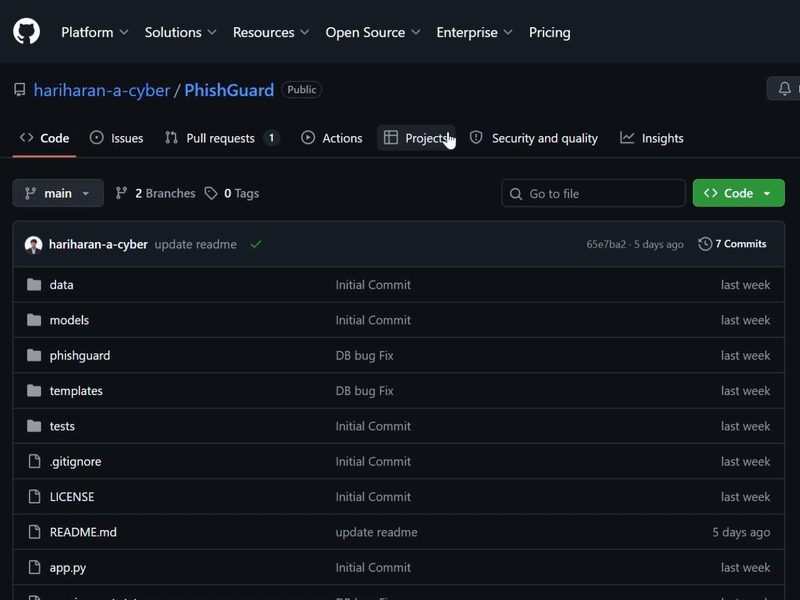

# RepoGuard

**A static application security scanner for GitHub repositories.** Paste a public repo URL and RepoGuard clones it, runs a five-stage deterministic analysis pipeline, and returns ranked, evidence-backed findings with concrete fixes — measured at **100% F1 on the test corpus**, with **100% precision** (zero false alarms on safe code in the corpus).

Built with FastAPI + a custom detection engine. No LLM in the critical detection path: the same commit always produces the same findings.

> **Why this exists:** most "vulnerability scanners" built as student projects are regex grep with a UI — they flag the word `password` in a comment and call it a finding. RepoGuard was built to be *trustworthy*: it can scan its own source code (a codebase full of vulnerability patterns stored as data) and still produce a clean report. That problem — telling a real `pickle.loads()` call apart from the string `"pickle.loads()"` in a docstring — is the core engineering challenge this project solves.

---

## Demo


*Paste a GitHub URL → live five-stage analysis → ranked findings with exact fixes.*

---

## What it does

- **Clones** any public GitHub repository into an isolated workspace.
- **Analyzes** it through five stages: pattern rules, AST + taint analysis, secret detection, dependency auditing, and scoring.
- **Ranks** findings by severity and confidence into a single 0–100 risk score.
- **Explains** each finding with its evidence, exact location, and a category-specific remediation.
- **Scans pull requests** automatically via an optional GitHub App (checks the exact PR commit, posts a status check).

Supported languages: **Python and Node.js** (JavaScript/TypeScript).

---

## Detection pipeline

Every scan runs five stages in sequence. Each is deterministic.

| Stage | What it does |
|-------|--------------|
| **1. Rule engine** | Pattern rules for injection, eval/exec, weak crypto, path traversal, NoSQL, SSTI, open redirect, and unsafe deserialization. |
| **2. AST & taint analysis** | Native Python `ast` for Python files; tree-sitter + source→sink taint tracking for JS/Go/C#. Reports flows that are *reachable*, not just present. |
| **3. Secret detection** | High-signal patterns (AWS, GitHub, Stripe, Slack, Google keys, PEM blocks) with entropy and placeholder filters to suppress test fixtures. |
| **4. Dependency audit** | Manifests checked against the OSV advisory database for known-vulnerable packages and their fixed versions. |
| **5. Scoring & ranking** | Findings merged, deduplicated across scanners, weighted by severity and confidence, rolled into one risk score. |

---

## The engineering problem worth reading about

The hardest part of a security scanner isn't finding vulnerabilities — it's **not crying wolf.** A scanner that floods you with false positives gets ignored, and an ignored scanner protects nothing.

RepoGuard hit this problem in its sharpest form when scanning **its own source code.** A security scanner's codebase is full of vulnerability patterns *as data* — rule definitions like `["random.randint", "random.random"]`, fix-example templates containing `pickle.load(file)`, detection strings like `"yaml.load("`. A naive regex scanner flags every one of these as a live vulnerability.

The fix was to replace substring matching with **AST-based detection** for the high-false-positive Python categories (pickle, yaml, eval/exec, subprocess, weak randomness). Python's built-in `ast` module parses each file into a syntax tree, and RepoGuard only flags a finding when it's a real **call expression** — never a string literal, comment, or identifier that merely *mentions* the pattern.

The difference, concretely:

```python
pickle.loads(untrusted_data)              # flagged — real call to a dangerous sink
docs = ["pickle.loads() is dangerous"]    # NOT flagged — it's a string
# yaml.load(data) without SafeLoader      # NOT flagged — it's a comment
```

This is the same approach real tools like Bandit and Semgrep take, and it's what lets RepoGuard scan codebases like its own without drowning the real findings in noise.

Other precision work in the same vein:
- **Excludes vendored/generated directories** (`node_modules`, `.venv`, `dist`) — dependency vulnerabilities are surfaced by the OSV audit instead of by scanning library source.
- **Allowlist-aware taint analysis** — recognizes `ALLOWED[req.query.x]` and `ROUTES.get(req.query.x)` as sanitizers, so safe redirects aren't flagged as open redirects.
- **Context-aware weak-random detection** — `random.random()` for retry jitter is ignored; `random.randint()` assigned to a `token` or `session_key` is flagged.

---

## Benchmark & methodology

Detection quality is **measured, not asserted.** RepoGuard ships with a benchmark harness (`benchmark/run_benchmark.py`) that runs the full production pipeline against a labeled corpus and reports precision, recall, and F1 per category.

**Current results (full pipeline):**

| Metric | Score |
|--------|-------|
| Precision | **100.0%** |
| Recall | **100.0%** |
| F1 | **100.0%** |

The corpus contains hand-authored vulnerable samples and safe "look-alike" traps (code that resembles a vulnerability but is safe) across categories including SQL/command/code injection, path traversal, NoSQL injection, secrets, open redirect, and weak randomness.

**Honest limitations** (documented in `benchmark/RESULTS.md`):
- The corpus is **hand-authored**, not scraped from real repositories, and the same author wrote both the corpus and the engine — so this is a measure of progress on a controlled set, **not** a claim of 100% accuracy on arbitrary real-world code. To validate externally, drop a real labeled dataset (e.g. the OWASP Benchmark) into `benchmark/corpus/` and re-run.
- Two cases that initially slipped through — SQL injection passed through an intermediate variable, and a secret split across two string literals — were traced and fixed by extending the taint analysis and secret matching. Both are now caught.

The benchmark is the development loop: every detection change is measured against it before and after, so improvements are verified and regressions are caught immediately rather than shipped.

---

## Tech stack

- **Backend:** FastAPI (Python), SQLite, multiprocessing scan workers
- **Detection:** custom rule engine, native Python `ast`, tree-sitter, OSV dependency database, Semgrep + Bandit integration
- **Frontend:** vanilla JS single-page app, dark developer theme, live scan-stage streaming
- **Auth:** email + Google One Tap; HMAC-signed bearer tokens with refresh rotation
- **Integration:** optional GitHub App for automated pull-request scanning

---

## Pull request scanning

Install the GitHub App and RepoGuard scans every pull request automatically,
posting a check run on the PR commit with the full findings summary.



---

## Running locally

Requires **Python 3.11+** and **git**.

```bash
# 1. clone and enter
git clone https://github.com/hariharan-a-cyber/RepoGuard.git
cd RepoGuard

# 2. virtual environment
python -m venv .venv
source .venv/bin/activate          # Windows: .venv\Scripts\activate

# 3. dependencies
pip install -r requirements.txt

# 4. configuration
cp .env.example .env
```

Edit `.env` with your values. The minimum required set:

```
# Auth — generate with: python -c "import secrets; print(secrets.token_hex(32))"
TOKEN_SECRET=<64-char random string>

# AI guidance on findings (get a key at aistudio.google.com)
GEMINI_API_KEY=<your Gemini API key>

# Google One Tap sign-in (create an OAuth client at console.cloud.google.com)
GOOGLE_CLIENT_ID=<your OAuth client ID>

ENV=development
```

Optional: set `LLM_API_KEY` + `LLM_BASE_URL` + `LLM_MODEL` for an OpenAI-compatible fallback when `GEMINI_API_KEY` is not set. See `.env.example` for the full reference.

Then run the server:

```bash
uvicorn backend.main:app --reload
```

Open **http://localhost:8000**, sign in, and scan a repository (try `https://github.com/pallets/flask`).

### Run the benchmark

```bash
python benchmark/run_benchmark.py
```

### Run the tests

```bash
pip install pytest
python -m pytest -q
```

---

## Project structure

```
backend/
  main.py              # FastAPI app, security headers, static serving
  routes/              # scan, auth, github app, metrics endpoints
  services/            # detection engine: rule_engine, ast_scanner,
                       # taint_service, secret_scanner, dependency_scanner,
                       # scanner_service (orchestration)
  utils/               # shared security helpers, scan-dir exclusions
frontend/              # single-page app (index.html, styles.css, app.js)
benchmark/             # labeled corpus + harness + results
tests/                 # ~230 unit/integration tests
```

---

## Roadmap

- External validation against the OWASP Benchmark and known-CVE project snapshots
- Externalized job/metrics state for multi-process deployment
- Additional language support (Go, Ruby)

---

## License

MIT

---

*Built by [Hariharan A](https://github.com/hariharan-a-cyber) — B.Tech IT, focused on application and offensive security.*
